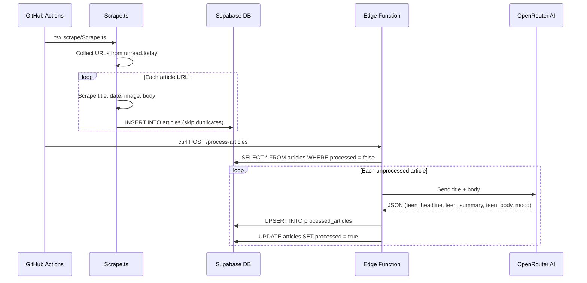

```mermaid
sequenceDiagram
    participant GH as GitHub Actions
    participant SC as Scrape.ts
    participant DB as Supabase DB
    participant EF as Edge Function
    participant AI as OpenRouter AI

    GH->>SC: tsx scrape/Scrape.ts
    SC->>SC: Collect URLs from unread.today
    loop Each article URL
        SC->>SC: Scrape title, date, image, body
        SC->>DB: INSERT INTO articles (skip duplicates)
    end
    GH->>EF: curl POST /process-articles
    EF->>DB: SELECT * FROM articles WHERE processed = false
    loop Each unprocessed article
        EF->>AI: Send title + body
        AI-->>EF: JSON (teen_headline, teen_summary, teen_body, mood)
        EF->>DB: UPSERT INTO processed_articles
        EF->>DB: UPDATE articles SET processed = true
    end
```